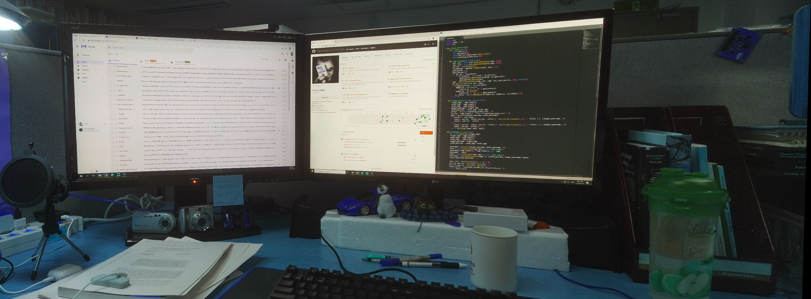

``` sh
            ____                                             
            |  _ \ __ _ _ __   ___  _ __ __ _ _ __ ___   __ _ 
            | |_) / _` | '_ \ / _ \| '__/ _` | '_ ` _ \ / _` |
            |  __/ (_| | | | | (_) | | | (_| | | | | | | (_| |
            |_|   \__,_|_| |_|\___/|_|  \__,_|_| |_| |_|\__,_|

```

Panoramic image stitching with overlapping images using SIFT detector, RANSAC algorithm and blending

## Try it yourself


1. #### Clone and cd into the repository:

    ```sh
    $ git clone https://github.com/stanleyedward/panorama-image-stitching.git
    $ cd panorama-image-stitching
     ```


2. #### Create and activate the conda environment:

    ```sh
    $ conda env create -f environment.yml
    $ conda activate panorama
    ```


3. #### Add your custom images to the `inputs/` folder manually or using the cmdline:
    ```sh
    $ mv left.jpg middle.jpg right.jpg inputs/
    ```
    dont have any images?   try the preloaded ones!


4. #### Run the script

    ```sh
    $ python panorama.py inputs/left.jpg inputs/middle.jpg inputs/right.jpg
    ```

    `Caution:` the order of the images should be `left to right` from the viewing point. 


5. #### Check it out!
    
    the output should be exported at `outputs/paranorama_image.jpg`

    

    This is the output of the following command:

    ```sh
    $ python panorama.py inputs/back/back_01.jpeg inputs/back/back_02.jpeg inputs/back/back_03.jpeg
    ```

    ``` sh
    ____                                             
    |  _ \ __ _ _ __   ___  _ __ __ _ _ __ ___   __ _ 
    | |_) / _` | '_ \ / _ \| '__/ _` | '_ ` _ \ / _` |
    |  __/ (_| | | | | (_) | | | (_| | | | | | | (_| |
    |_|   \__,_|_| |_|\___/|_|  \__,_|_| |_| |_|\__,_|


    Initializing...
    Panoramic image saved at: outputs/panorama_image.jpg
    ```