``` sh
____                                             
|  _ \ __ _ _ __   ___  _ __ __ _ _ __ ___   __ _ 
| |_) / _` | '_ \ / _ \| '__/ _` | '_ ` _ \ / _` |
|  __/ (_| | | | | (_) | | | (_| | | | | | | (_| |
|_|   \__,_|_| |_|\___/|_|  \__,_|_| |_| |_|\__,_|

```

Panoramic image stitching with overlapping images using SIFT detector, Homography, RANSAC algorithm and weighted blending.

## Try it yourself


1. #### Clone and cd into the repository:

    ```sh
    git clone https://github.com/stanleyedward/panorama-image-stitching.git
    cd panorama-image-stitching
     ```


2. #### Create and activate the conda environment:

    ```sh
    conda env create -f environment.yml
    conda activate panorama
    ```


3. #### Add your custom images to the `inputs/` folder manually or using the command line:
    ```sh
    mv left.jpg middle.jpg right.jpg inputs/
    ```
    dont have any images?   try the preloaded ones located in `inputs/`


4. #### Run the script

    ```sh
    python panorama.py inputs/front/front_01.jpeg inputs/front/front_02.jpeg inputs/front/front_03.jpeg
    ```

    `Caution:` The sequence of images should be ordered `left to right` from the viewing point. 


5. #### Check it out!
    > if your results are unsatisfactory
    consider increasing or decreasing the `smoothing_window_percent` value in `line 13` of [image_stitching/image_stitching.py](image_stitching/image_stitching.py) 

    the output should be exported at `outputs/paranorama_image.jpg`

    

    This is the output of the following command:

    ```sh
    python panorama.py inputs/back/back_01.jpeg inputs/back/back_02.jpeg inputs/back/back_03.jpeg
    ```

    ``` sh
    ____                                             
    |  _ \ __ _ _ __   ___  _ __ __ _ _ __ ___   __ _ 
    | |_) / _` | '_ \ / _ \| '__/ _` | '_ ` _ \ / _` |
    |  __/ (_| | | | | (_) | | | (_| | | | | | | (_| |
    |_|   \__,_|_| |_|\___/|_|  \__,_|_| |_| |_|\__,_|


    Initializing...
    Panoramic image saved at: outputs/panorama_image.jpg
    ```


## References


- [First Principles of Computer Vision - Shree K. Nayar](https://fpcv.cs.columbia.edu/)

- [Distinctive Image Features from Scale-Invariant Keypoints (SIFT)](https://people.eecs.berkeley.edu/~malik/cs294/lowe-ijcv04.pdf)

- https://github.com/linrl3/Image-Stitching-OpenCV

- https://github.com/Yunyung/Automatic-Panoramic-Image-Stitching


## Explained


1. #### Feature Detection using SIFT 

The **scale-invariant feature transform** is a computer vision algorithm to detect interest points, describe, and match local features in images. [David Lowe 1999]

The image is convolved with a series of Gaussian filters at different scales to create a scale-space representation. Local extrema in this scale-space are identified as potential key points. Therefore, the scale space of an image is defined as a function, $L(x, y, σ)$, that is produced from the convolution of a variable-scale Gaussian, $G(x, y, σ)$, with an input image, $I(x, y)$:

where    $$L(x, y, \sigma) = G(x, y, \sigma) \ast I(x, y)$$

To efficiently detect stable keypoint locations in scale space,
using scale-space extrema in the difference-of-Gaussian function convolved with the image,
$D(x, y, σ)$, which can be computed from the difference of two nearby scales separated by a
constant multiplicative factor k:

$$D(x, y, σ) = (G(x, y, kσ) − G(x, y, σ)) ∗ I(x, y)$$
$$= L(x, y, kσ) − L(x, y, σ)$$

<p align="center">
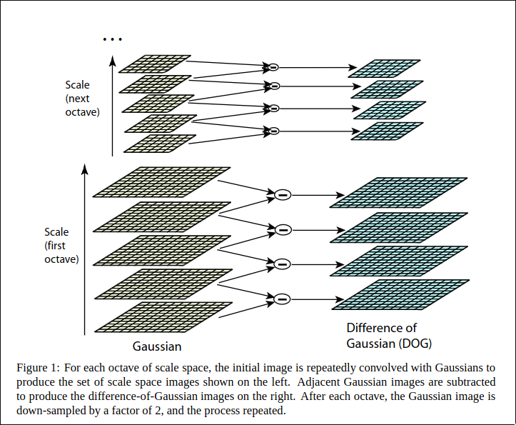 
</p>

In addition, the difference-of-Gaussian function provides a close approximation to the
scale-normalized Laplacian of Gaussian, σ2∇2G, as studied by Lindeberg (1994).
and therefore,


$$G(x, y, kσ) − G(x, y, σ) ≈ (k − 1)σ^2∇^b2G$$

<p align="center">

</p>

the Laplacian of Gaussian is used for feature detection by highlighting regions of rapid intensity change in an image, it is often applied to identify key points or interest points in an image.

### To refine keypoint locations:

Fit a 3D quadratic function to the nearby DoG extrema to achieve subpixel precision. Eliminate low-contrast keypoints and poorly localized keypoints along edges.

<p align="center">
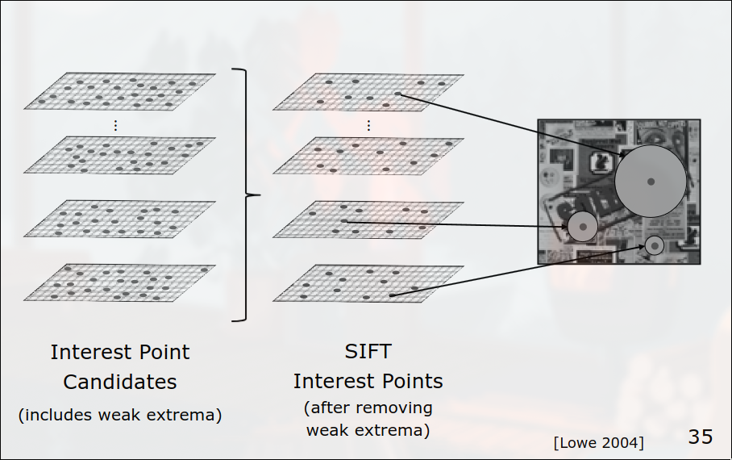
</p>

### Orientation Assignment:

Compute gradient magnitude and orientation around each keypoint. Construct histograms to determine the dominant orientation. Keypoints are assigned orientations based on the histogram peaks. 

By analyzing the gradient orientation around a keypoint, **SIFT ensures that the descriptor is invariant to rotation**. The gradient information is used to construct a descriptor that captures the local structure around the keypoint. 

<p align="center">
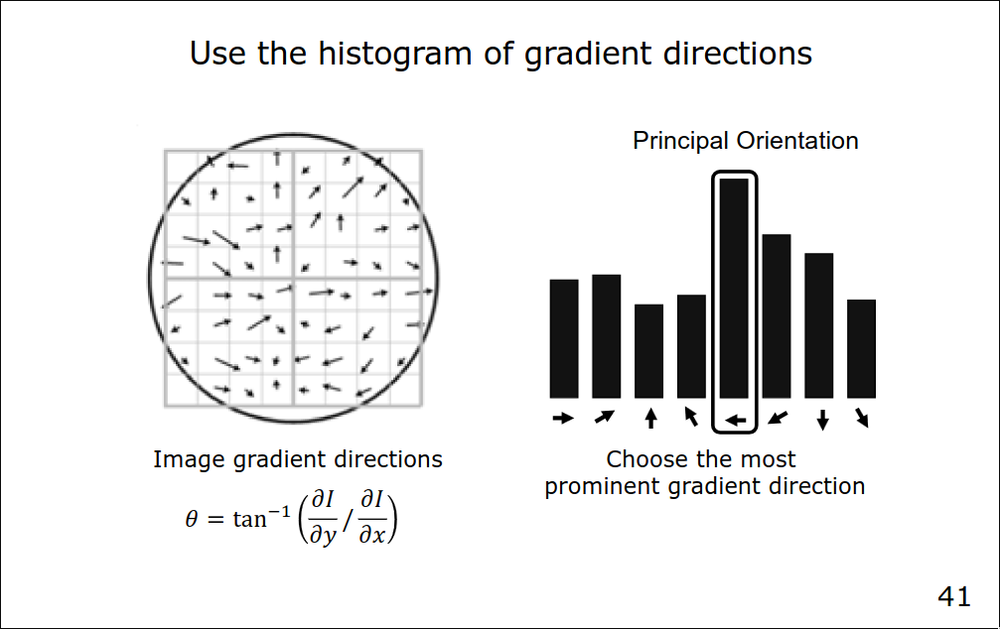
</p>

### Result of SIFT on my input

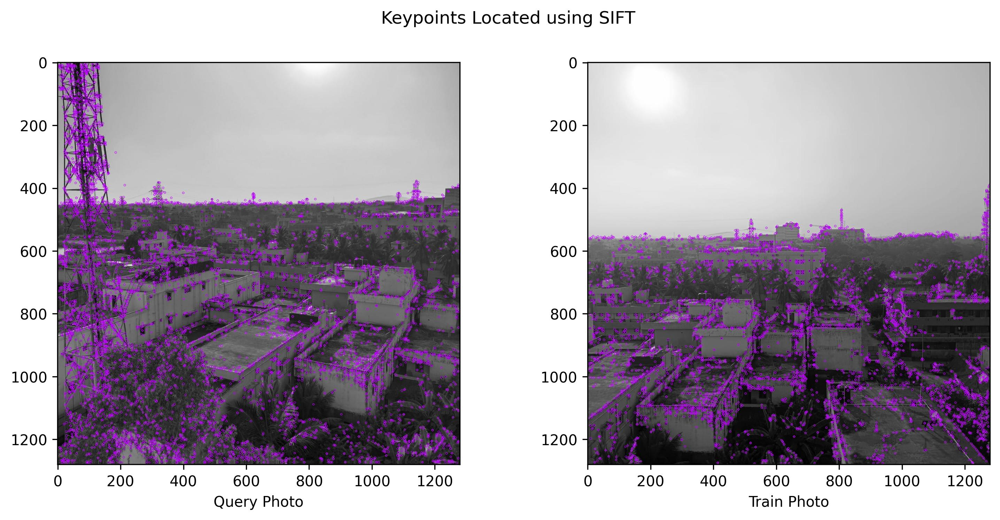

2. #### Matching keypoints

In feature matching, the primary objective is to establish correspondences between keypoints detected in different images. This process is fundamental in tasks such as image stitching, object recognition, and 3D reconstruction.

#### Distance Metric

Keypoints are characterized by descriptors, which are feature vectors representing the local image information around each keypoint. A common approach is to use a distance metric, such as Euclidean distance, to measure the similarity or dissimilarity between the descriptors of two keypoints. Smaller distances indicate higher similarity.

The L2 norm is calculated using the Euclidean distance formula, which is the square root of the sum of squared differences between corresponding elements of two vectors.

Let's denote the descriptor vectors of two keypoints as $v_1$​ and $v_2$​, and their corresponding L2 (Euclidean) distance as $d_L2$:​

$$ d_{L2}(v_1, v_2) = \sqrt{\sum_{i=1}^{n} (v_{1i} - v_{2i})^2} $$


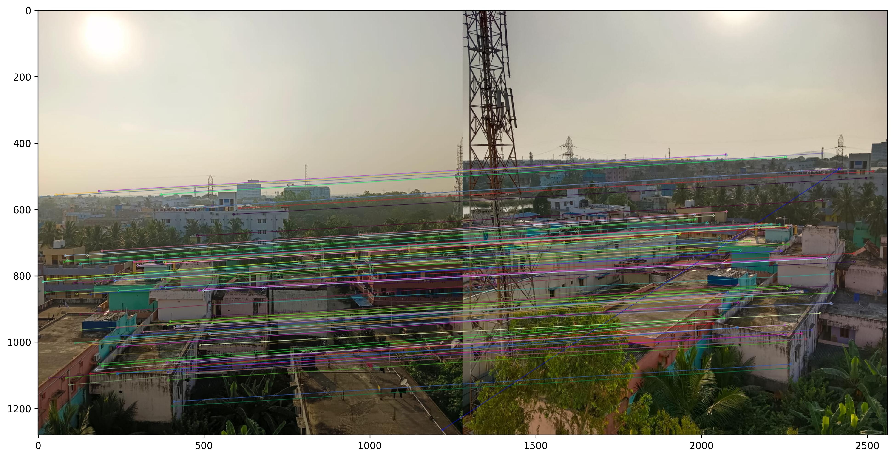


3. #### Computing the Homography Matrix
A homography matrix, often denoted as $H$, is a transformation matrix used in computer vision to represent a projective transformation between two images of the same planar surface. The homography matrix describes the geometric relationship between corresponding points in the two images.


The homography matrix is a 3x3 matrix and can be represented as:

$$ H = \begin{bmatrix} h_{11} & h_{12} & h_{13} \\\ h_{21} & h_{22} & h_{23} \\\ h_{31} & h_{32} & h_{33} \end{bmatrix} $$

Homography Transformation Equation:

$$ \begin{bmatrix} x' \\\ y' \\\ w' \end{bmatrix} = \begin{bmatrix} h_{11} & h_{12} & h_{13} \\\ h_{21} & h_{22} & h_{23} \\\ h_{31} & h_{32} & h_{33} \end{bmatrix} \cdot \begin{bmatrix} x \\\ y \\\ 1 \end{bmatrix} $$

- It helps align and transform the images correctly, ensuring that corresponding points in different images are mapped to the same coordinates in the final panorama.


4. #### RANSAC algorithm

How exactly do you find the values for your Homography Matrix? RANSAC comes to the rescue!
RANSAC (Random Sample Consensus) is an iterative algorithm commonly used in computer vision to estimate a model's parameters from a set of data points containing outliers. In the context of estimating a homography matrix, RANSAC is often used when dealing with correspondences between points in two images that may include outliers or mismatches.

The steps of RANSAC algorithm are as follows:

    1. Sample(Randomly) the number of points required to fit the model (Homography), for our purpose the number is 4, to fit the model.

    2. Fit the model to the randomly chosen samples

    3. Count the number M of datapoints (inliers) that fit the model within a measure or error E, ie acceptable alignment error of pixels.

    4. Repeat the steps 1-3 N times.

    5. Choose the model that has the largest No of M inliers


<p align="center">
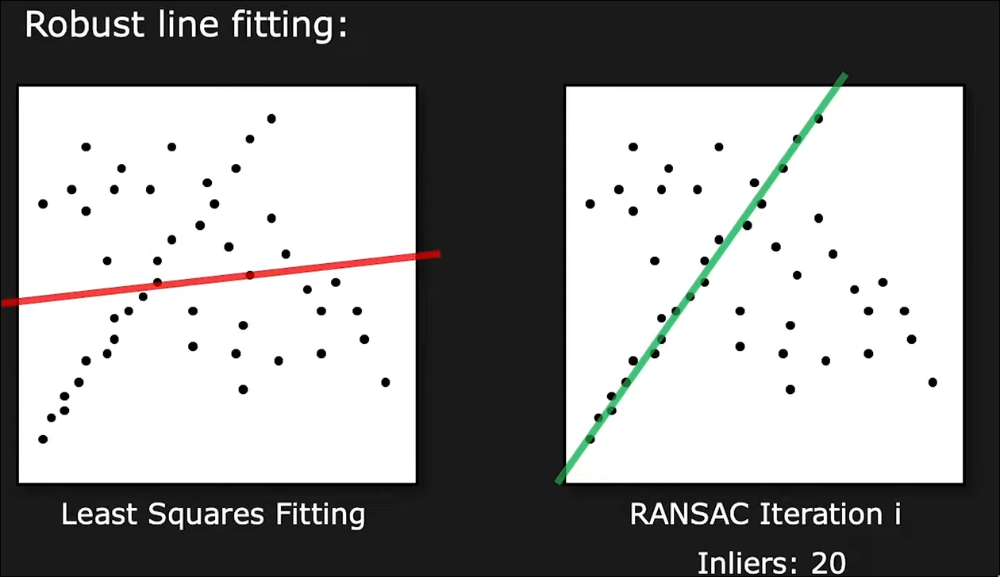
</p>

`note:` The number of outliers needs to be < 50% for RANSAC to work.

5. #### Weighted Blending

Hard seams may arise due to vignetting, exposure differences, illumination differences. Averaging the images doesn't solve the issue and seams might still be visible. Therefore weighted blending comes into use.

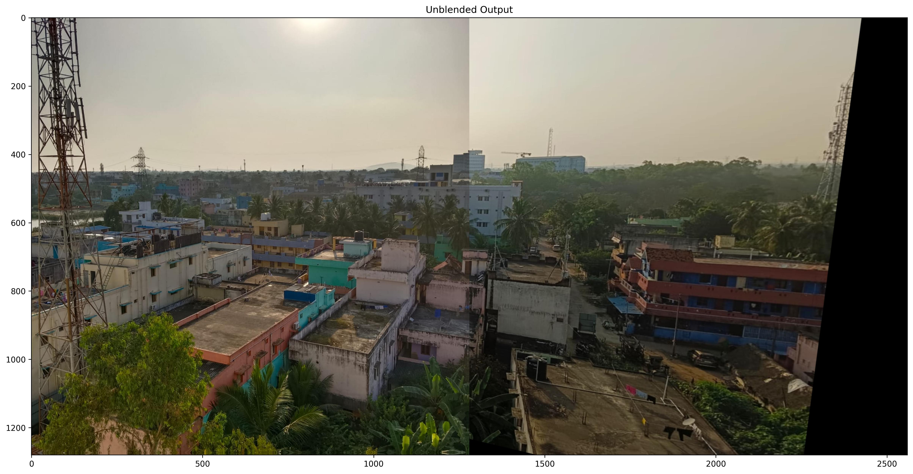

Weight blending using masks involves blending images based on pixel weights assigned via masks.
Masks are binary images where each pixel value determines the contribution or weight of the corresponding pixel in the blending process.

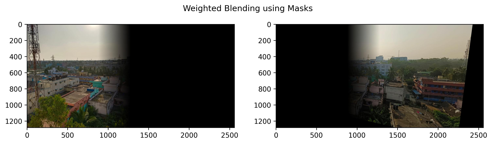

<p align="center">
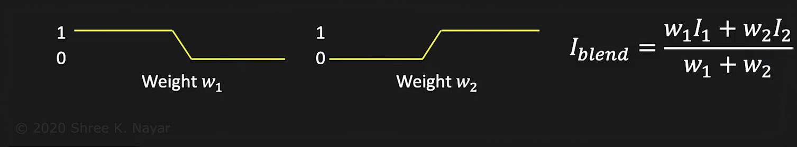
</p>


The mask should have the same dimensions as the image, and each pixel in the mask is assigned a weight value between 0 and 1. The mask is then normalized to maintain the overall color intensity and brightness during blending.

<p align="center">
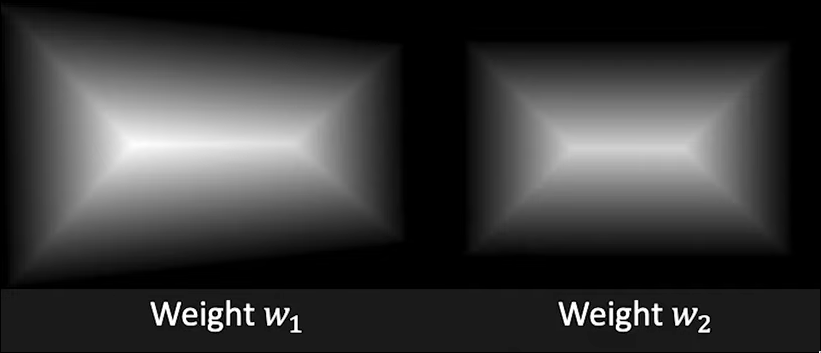
</p>

The purpose of weighted blending is to create a seamless transition between overlapping regions of images, taking into account the relative importance or contribution of each pixel, allowing for a smooth and controlled transition in overlapping regions.

###  The Final Output After blending the 2 images.

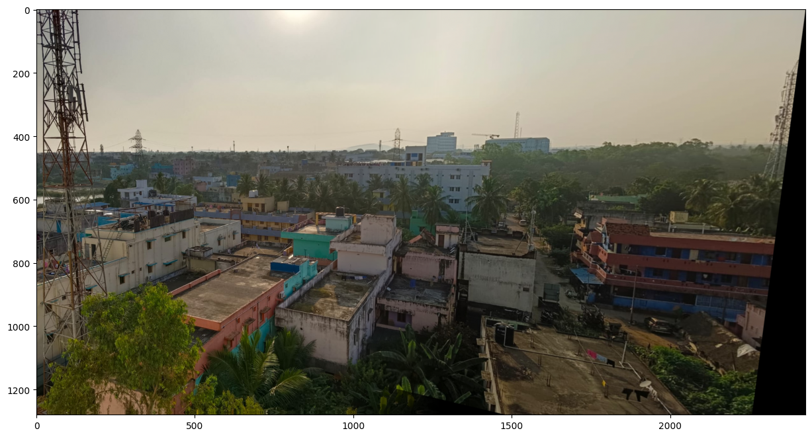

### - Stitching multiple images using `recursion` we can obtain a wider panorama:


